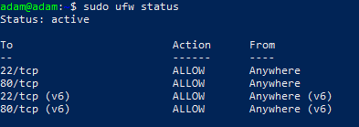

# Rendu TP 
### Mise en place d'un serveur web avec un accès ssh sécurisé

1.
```
Pour créer une vm Ubuntu sans interface graphique j'ai teléchargé un iso qui s'appelle ubuntu live serveur qui est un iso conçu pour les vm sans interfaces.
```

2.
```
 Ensuite j'ai crée une deuxième carte reseaux dans la configuration de la vm avec commemode accès reseau privé hote.
```
   

```
SSH fonctionne bien sur cette vm
```


3. 
```
Ensuite j'ai changé le html du serveur web ce qui nous donne:
```


4.
```
Après j'ai autorisé les ports 22 et 80 
```


5.
```
J'ai securisé SSH c'est à dire que je peux me connecter grâce à une clé et non grace à mon mdp.
```


6.
```
Ensuite j'ai fait en sorte de me connecter en ssh grace à un code google authentificator.
```


 